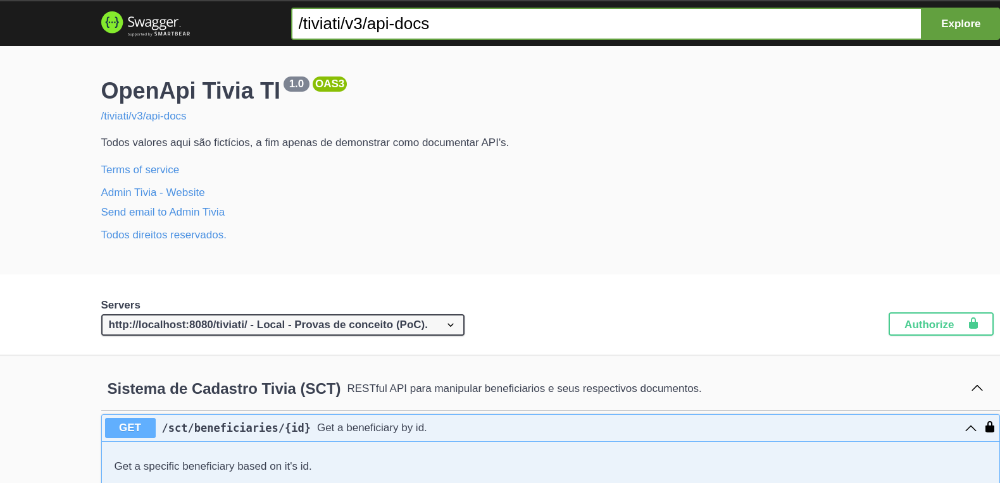
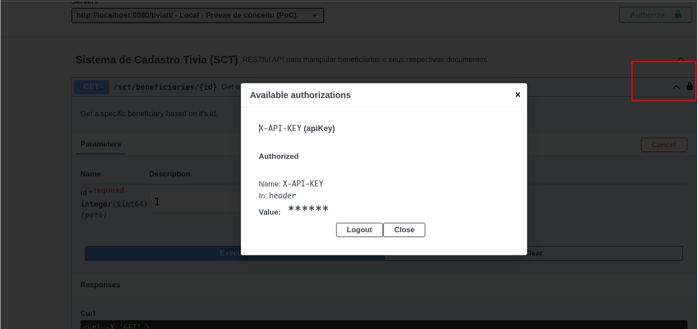

# Sistema de Cadastro Tivia - SCT

Esse sistema tem como objetivo, disponibilizar uma API centralizada em cadastros de beneficiários e seus respectivos documentos.

As operações básicas deste sistema têm seus aspectos baseados nas operações de persistência CRUD (Create, Read, Update e Delete).

# Especificações

Esse sistema foi configurado com a versão Spring Boot 3.x, com a versão Java 17. O gerenciador de dependência é o Maven, e está
na versão 4.x, porém, é ainda compatível com as últimas versões do 3.9, por a 'minor version', 3.9.x.

# Configuração

##### Banco de dados
O banco de dados está sendo executado em memória, e toda sua configuração está automatizada, inclusive com scripts SQLs. O banco embarcado
escolhido foi o h2.

As credenciais para acesso são:

---
url console -> http://localhost:8080/tiviati/h2-console  
database -> testdb  
user -> tiviati  
pass -> ttsct  
jdbc url -> jdbc:h2:mem:testdb  

---

##### Execução do Projeto
A subida do projeto, pode ser feita pela linha comando ou pela sua IDE preferida.

Por exemplo:

```bash
mvn clean spring-boot:run
```

A raiz de contexto é a /tiviati, ou seja, o serviço escuta na porta 8080 e com a respectiva URL:

***http://localhost:8080/tiviati***

##### Swagger

A URL do Swagger pode ser acessada através do seguinte endereço:

***http://localhost:8080/tiviati/swagger-ui/index.html***

O mapeamento das operações da API, está em sct. Veja mais exemplos em [casos de uso](#caso-de-uso) para mais detalhes.

# Casos de uso

Para testar esta API e seus recursos, as requisições podem ser realizadas através da linha de comando, pelo utilitário curl ou através da Interface de Usuário do Swagger.

Exemplo via linha de comando:

```bash
curl -X 'GET' \
  'http://localhost:8080/tiviati/sct/beneficiaries/1' \
  -H 'accept: application/json'
```

Ou através da interface de usuário do Swagger, conforme endereço mapeado na seção [Swagger](#swagger).



# Segurança

Essa API está utilizando um identificador API Key como forma de autenticação e autorização para uso dos recursos disponibilizados.
O cabeçalho que representa o valor do token na requisição, está apresentado com padrão 'X-API-KEY'.

Ou seja, a cada requisição é necessário se autenticar com o uso do token no cabeçalho da requisição. Ex:

```bash
curl -X 'GET' \
  'http://localhost:8080/tiviati/sct/beneficiaries/1' \
  -H 'accept: */*' \
  -H 'X-API-KEY: foo'
```

O exemplo acima está com um valor fictício. A fim de consumir o tempo de quem vai avaliar essa API, irei colocar aqui qual é o valor do token, caso
contrário, esse valor está disponível no banco, na tabela TIVIATI_SECURITY, na coluna nomeada token.

Segue a chave:

**tiviatisct**

configure o cabeçalho para este valor:

-H 'X-API-KEY: tivatisct'

---
***Nota***

Este token pode ser gerado dinamicamente. Deixei a abstração preparada para receber outras formas de autenticação. Não está acoplada em uma única
específica. Passei aqui o valor, só para agilizar a informação, porém, esse valor do token está na tabela TIVIATI_SECURITY, conforme citado
anteriormente.

SELECT * FROM TIVIATI_SECURITY;

---

##### Via Swagger

A configuração é covencional, clicando no ícone do cadeado e colocando o valor do token citado anteriormente.





# Extra

Adicionei uma forma de executar a aplicação dentro de um container, caso o ambiente não conte com as configurações da plataforma java(JDK Runtime),
mas conte com um ambiente Docker.

Basta executar:

```bash
docker run -p8080:8080 tiviatisct:latest
```

O acesso à aplicação segue da mesma forma citada nas seções anteriores.

Para finalizar a execucação e remover o container:

```bash
docker stop tiviatisct
docker rm tiviatisct
```
